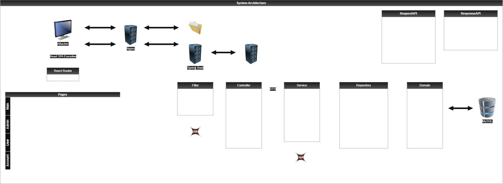
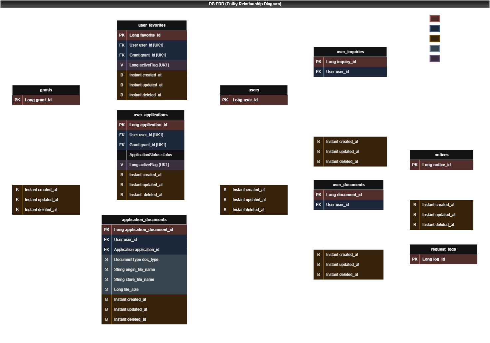

# Secure Web Application Lab - 정부 지원금 사이트
> **웹 모의해킹 취약점 진단 및 보고서 작성을 위해 자체 제작한 타겟 웹 애플리케이션**

---

## 프로젝트 개요 (Overview)
본 프로젝트는 **정부지원금 서비스**를 모티브로 제작되었으며 
실제 웹 모의해킹 시나리오 수행 및 **취약점 진단 보고서** 작성을 목적으로 개발된 애플리케이션입니다.

---

## 기술 스택 (Tech Stack)

### Backend / Infrastructure
- **Language:** Java
- **Framework:** Spring Boot
- **Database:** MySQL
- **Build Tool:** Gradle

### Frontend
- React

---

## 시스템 구조 및 설계 (Architecture)

### System Architecture

### Database ERD

### Features

#### Public (비회원/공통)

- Grant (지원금 제도)

    - 지원금 제도 조회: 등록된 지원금 제도 목록 검색, 세부 내용 조회

- Notice (공지사항)

    - 공지사항 조회: 시스템 안내 및 지원금 관련 공지사항 목록 및 상세 내용 조회

- Account (계정)

    - 회원가입: 신규 사용자 정보를 등록하여 서비스 이용 계정 생성

    - 로그인: 사용자 자격 증명을 검증하고 시스템 접근 권한(세션) 부여

    - 세션 인증 확인: 현재 클라이언트의 세션 유효성 및 로그인 상태 검증

#### User (일반 사용자)

- Application (지원금 신청)

    - 지원금 신청: 필요한 정보 작성 및 증빙 서류 제출을 통해 신청 등록

    - 신청 내역 조회: 본인이 신청한 지원금의 심사 진행 상태 및 상세 정보 조회

    - 신청 취소: 지원금 신청건에 대한 직접 철회

- Document (서류)

    - 서류 등록: 지원금 신청에 필요한 필수/추가 증빙 서류 파일 업로드

    - 서류 조회: 본인이 업로드한 제출 서류 목록 확인

    - 서류 삭제: 잘못 업로드했거나 불필요한 서류 파일 삭제

    - 서류 다운로드: 제출했던 증빙 서류 파일 재다운로드

- Favorite (즐겨찾기)

    - 지원금 즐겨찾기 등록: 관심 있는 지원금 제도를 개인 즐겨찾기 목록에 추가

    - 즐겨찾기 조회: 등록한 관심 지원금 목록 모아보기 및 모집 상태 확인

    - 즐겨찾기 삭제: 즐겨찾기 목록에서 특정 지원금 항목 제거

- Inquiry (1:1 문의)

    - 문의 등록: 지원금 신청 및 서비스 이용 관련 문의글 작성

    - 문의 조회: 본인이 작성한 문의글 목록 및 관리자의 답변 내용 확인

    - 문의 수정: 문의글 내용 보완 및 수정

    - 문의 삭제: 작성한 문의글 삭제 처리

- Account (계정)

    - 로그아웃: 현재 인증된 사용자 세션을 만료시키고 보안 접속 종료

#### Admin (관리자)

- Application (신청 관리)

    - 지원금 신청 상태 관리: 제출된 사용자 신청건에 대한 심사 진행 및 상태 변경

- Grant (지원금 제도 관리)

    - 지원금 제도 등록: 신규 지원금 사업 정보 작성

    - 지원금 제도 수정: 기존 지원금 사업의 상세 내용 변경

    - 지원금 제도 삭제: 불필요하거나 오등록된 지원금 제도 삭제 처리

    - 지원금 모집 상태 관리: 지원금 제도의 모집 상태 변경

- Inquiry (문의 관리)

    - 문의 답변 등록: 사용자가 등록한 문의에 대한 공식 답변 작성 및 처리 완료 상태 변경

- Notice (공지사항 관리)

    - 공지사항 등록: 시스템 안내 및 지원금 관련 안내사항 작성

    - 공지사항 수정: 이미 게시된 공지사항 내용 보완 및 수정

    - 공지사항 삭제: 만료되거나 불필요한 공지사항 삭제 처리

- Account (회원 관리)

    - 사용자 계정 조회: 전체 회원 목록 검색 및 세부 정보 조회

    - 사용자 계정 삭제: 부적절한 이용자 등에 대한 관리자 권한의 계정 강제 정지 및 탈퇴 처리
---

## 의도적 취약점 진단 범위 (Intentional Vulnerabilities)
*본 애플리케이션에는 OWASP Top 10 취약점중 일부가 의도적으로 포함되어 있습니다.*

- 시나리오 1
  - [Reconnaissance] IDOR 기반 계정 열거(Enumeration)를 통한 최상위 관리자 계정 식별
  - [Info Leak] Path Traversal을 통한 application.yml 탈취로 정적 자원 매핑 경로 및 파일 저장 구조 파악
  - [Privilege Escalation] Inquiry Service Stored XSS를 활용한 관리자 Session Hijacking 및 권한 승격
  - [Data Exfiltration] 관리자 페이지를 통한 지원자 민감 서류(등본/소득증명) 대량 유출
  - [Second-Order SQLi] 악성 쿼리가 관리자 로그 모니터링 시 수행되어 DB Exfiltration
  - [Persistence] 2단계에서 확보한 경로 정보를 바탕으로 Unauthenticated File Upload ➔ Direct Execution ➔ RCE 및 WebShell을 통한 지속성 확보

- 시나리오 2
  - 지원금 신청관련 서비스동작시 동시성 제어 문제로 인한 중복 지원금 신청가능

---

## 모의해킹 진단 보고서 (Penetration Testing Report)
- **정부지원금 사이트 웹 취약점 진단 보고서** *(작성 완료 후 첨부 예정)*
- **시나리오 기반 웹 애플리케이션 침투테스트 보고서** *(작성 완료 후 첨부 예정)*